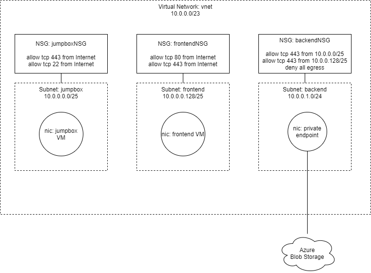

# Azure Resource Graphs

Labyrinth provides a sample application that converts an [Azure Resource Graph](https://docs.microsoft.com/en-us/azure/governance/resource-graph/overview#:~:text=Azure%20Resource%20Graph%20is%20a,can%20effectively%20govern%20your%20environment.) into a Labyrinth graph, suitable for flow analysis.

## Exporting the Azure Resource Graph

You can use the `az` command to export the `Azure Resource Graph`. In the example, below, replace `"labyrinth-sample"` with the name of your resource group.

~~~
% az graph query -q 'resources | where resourceGroup == "labyrinth-sample" | where type in~ ("Microsoft.Network/n
etworkInterfaces", "Microsoft.Network/networkSecurityGroups", "Microsoft.Network/virtualNetworks")' > resources.json
~~~

## Sample Azure Resource Graph

Labyrinth includes a sample Azure Resource Graph in [resource-graph-1.json](data/azure/resource-graph 1.json). This was exported from an actual Azure deployment. It has the following structure:

## Converting the Azure Resource Graph

Use the `convert.js` application to generate a Labyrinth graph file:

[//]: # (spawn node build/src/apps/convert.js data/azure/resource-graph-1.json data/azure/resource-graph-1.yaml)
~~~
$ node build/src/apps/convert.js data/azure/resource-graph-1.json data/azure/resource-graph-1.yaml
Azure resource graph input file: data/azure/resource-graph-1.json
Labyrinth graph output file: data/azure/resource-graph-1.yaml
Conversion complete.

~~~

This will write the Labyrinth graph to [resource-graph-1.yaml](./data/azure/resource-graph 1.yaml):

[//]: # (file data/azure/resource-graph-1.yaml)
~~~
symbols:
  - dimension: ip
    symbol: Internet
    range: except vnet
  - dimension: ip
    symbol: AzureLoadBalancer
    range: 168.63.129.16
  - dimension: protocol
    symbol: Tcp
    range: tcp
  - dimension: ip
    symbol: vnet
    range: 10.0.0.0/23
nodes:
  - key: data.nic.b367ee68-39d3-47ca-8592-c233fb2fee4a/blob-blob.privateEndpoint
    endpoint: true
    range:
      sourceIp: 10.0.1.4
    rules:
      - constraints:
          destinationIp: backendSubnet/router
        destination: backendSubnet/router
  - key: frontend/default
    endpoint: true
    range:
      sourceIp: 10.0.0.132
    rules:
      - constraints:
          destinationIp: frontendSubnet/router
        destination: frontendSubnet/router
  - key: jumpbox/default
    endpoint: true
    range:
      sourceIp: 10.0.0.4
    rules:
      - constraints:
          destinationIp: jumpboxSubnet/router
        destination: jumpboxSubnet/router
  - key: jumpboxSubnet/router
    range:
      sourceIp: 10.0.0.0/25
    rules:
      - constraints:
          destinationIp: except 10.0.0.0/25
        destination: jumpboxSubnet/outbound
      - destination: jumpbox/default
        constraints:
          destinationIp: 10.0.0.4
  - key: jumpboxSubnet/inbound
    filters:
      - action: allow
        priority: 65000
        id: 1
        source: data/azure/resource-graph-1.json
        constraints:
          sourceIp: vnet
          sourcePort: '*'
          destinationIp: vnet
          destinationPort: '*'
          protocol: '*'
      - action: allow
        priority: 65001
        id: 1
        source: data/azure/resource-graph-1.json
        constraints:
          sourceIp: AzureLoadBalancer
          sourcePort: '*'
          destinationIp: '*'
          destinationPort: '*'
          protocol: '*'
      - action: deny
        priority: 65500
        id: 1
        source: data/azure/resource-graph-1.json
        constraints:
          sourceIp: '*'
          sourcePort: '*'
          destinationIp: '*'
          destinationPort: '*'
          protocol: '*'
      - action: allow
        priority: 1000
        id: 1
        source: data/azure/resource-graph-1.json
        constraints:
          sourceIp: Internet
          sourcePort: '*'
          destinationIp: '*'
          destinationPort: '22'
          protocol: Tcp
      - action: allow
        priority: 1100
        id: 1
        source: data/azure/resource-graph-1.json
        constraints:
          sourceIp: Internet
          sourcePort: '*'
          destinationIp: '*'
          destinationPort: '443'
          protocol: Tcp
    rules:
      - destination: jumpboxSubnet/router
  - key: jumpboxSubnet/outbound
    filters:
      - action: allow
        priority: 65000
        id: 1
        source: data/azure/resource-graph-1.json
        constraints:
          sourceIp: vnet
          sourcePort: '*'
          destinationIp: vnet
          destinationPort: '*'
          protocol: '*'
      - action: allow
        priority: 65001
        id: 1
        source: data/azure/resource-graph-1.json
        constraints:
          sourceIp: '*'
          sourcePort: '*'
          destinationIp: Internet
          destinationPort: '*'
          protocol: '*'
      - action: deny
        priority: 65500
        id: 1
        source: data/azure/resource-graph-1.json
        constraints:
          sourceIp: '*'
          sourcePort: '*'
          destinationIp: '*'
          destinationPort: '*'
          protocol: '*'
    range:
      sourceIp: 10.0.0.0/25
    rules:
      - destination: vnet
  - key: frontendSubnet/router
    range:
      sourceIp: 10.0.0.128/25
    rules:
      - constraints:
          destinationIp: except 10.0.0.128/25
        destination: frontendSubnet/outbound
      - destination: frontend/default
        constraints:
          destinationIp: 10.0.0.132
  - key: frontendSubnet/inbound
    filters:
      - action: allow
        priority: 65000
        id: 1
        source: data/azure/resource-graph-1.json
        constraints:
          sourceIp: vnet
          sourcePort: '*'
          destinationIp: vnet
          destinationPort: '*'
          protocol: '*'
      - action: allow
        priority: 65001
        id: 1
        source: data/azure/resource-graph-1.json
        constraints:
          sourceIp: AzureLoadBalancer
          sourcePort: '*'
          destinationIp: '*'
          destinationPort: '*'
          protocol: '*'
      - action: deny
        priority: 65500
        id: 1
        source: data/azure/resource-graph-1.json
        constraints:
          sourceIp: '*'
          sourcePort: '*'
          destinationIp: '*'
          destinationPort: '*'
          protocol: '*'
      - action: allow
        priority: 1000
        id: 1
        source: data/azure/resource-graph-1.json
        constraints:
          sourceIp: Internet
          sourcePort: '*'
          destinationIp: '*'
          destinationPort: '80'
          protocol: Tcp
      - action: allow
        priority: 1100
        id: 1
        source: data/azure/resource-graph-1.json
        constraints:
          sourceIp: Internet
          sourcePort: '*'
          destinationIp: '*'
          destinationPort: '443'
          protocol: Tcp
    rules:
      - destination: frontendSubnet/router
  - key: frontendSubnet/outbound
    filters:
      - action: allow
        priority: 65000
        id: 1
        source: data/azure/resource-graph-1.json
        constraints:
          sourceIp: vnet
          sourcePort: '*'
          destinationIp: vnet
          destinationPort: '*'
          protocol: '*'
      - action: allow
        priority: 65001
        id: 1
        source: data/azure/resource-graph-1.json
        constraints:
          sourceIp: '*'
          sourcePort: '*'
          destinationIp: Internet
          destinationPort: '*'
          protocol: '*'
      - action: deny
        priority: 65500
        id: 1
        source: data/azure/resource-graph-1.json
        constraints:
          sourceIp: '*'
          sourcePort: '*'
          destinationIp: '*'
          destinationPort: '*'
          protocol: '*'
    range:
      sourceIp: 10.0.0.128/25
    rules:
      - destination: vnet
  - key: backendSubnet/router
    range:
      sourceIp: 10.0.1.0/24
    rules:
      - constraints:
          destinationIp: except 10.0.1.0/24
        destination: backendSubnet/outbound
      - destination: >-
          data.nic.b367ee68-39d3-47ca-8592-c233fb2fee4a/blob-blob.privateEndpoint
        constraints:
          destinationIp: 10.0.1.4
  - key: backendSubnet/inbound
    filters:
      - action: allow
        priority: 65000
        id: 1
        source: data/azure/resource-graph-1.json
        constraints:
          sourceIp: vnet
          sourcePort: '*'
          destinationIp: vnet
          destinationPort: '*'
          protocol: '*'
      - action: allow
        priority: 65001
        id: 1
        source: data/azure/resource-graph-1.json
        constraints:
          sourceIp: AzureLoadBalancer
          sourcePort: '*'
          destinationIp: '*'
          destinationPort: '*'
          protocol: '*'
      - action: deny
        priority: 65500
        id: 1
        source: data/azure/resource-graph-1.json
        constraints:
          sourceIp: '*'
          sourcePort: '*'
          destinationIp: '*'
          destinationPort: '*'
          protocol: '*'
      - action: allow
        priority: 1000
        id: 1
        source: data/azure/resource-graph-1.json
        constraints:
          sourceIp: 10.0.0.0/25
          sourcePort: '*'
          destinationIp: '*'
          destinationPort: '443'
          protocol: Tcp
      - action: allow
        priority: 1100
        id: 1
        source: data/azure/resource-graph-1.json
        constraints:
          sourceIp: 10.0.0.128/25
          sourcePort: '*'
          destinationIp: '*'
          destinationPort: '443'
          protocol: Tcp
    rules:
      - destination: backendSubnet/router
  - key: backendSubnet/outbound
    filters:
      - action: allow
        priority: 65000
        id: 1
        source: data/azure/resource-graph-1.json
        constraints:
          sourceIp: vnet
          sourcePort: '*'
          destinationIp: vnet
          destinationPort: '*'
          protocol: '*'
      - action: allow
        priority: 65001
        id: 1
        source: data/azure/resource-graph-1.json
        constraints:
          sourceIp: '*'
          sourcePort: '*'
          destinationIp: Internet
          destinationPort: '*'
          protocol: '*'
      - action: deny
        priority: 65500
        id: 1
        source: data/azure/resource-graph-1.json
        constraints:
          sourceIp: '*'
          sourcePort: '*'
          destinationIp: '*'
          destinationPort: '*'
          protocol: '*'
      - action: deny
        priority: 1000
        id: 1
        source: data/azure/resource-graph-1.json
        constraints:
          sourceIp: '*'
          sourcePort: '*'
          destinationIp: Internet
          destinationPort: '*'
          protocol: Tcp
    range:
      sourceIp: 10.0.1.0/24
    rules:
      - destination: vnet
  - key: vnet
    range:
      sourceIp: 10.0.0.0/23
    rules:
      - destination: Internet
        constraints:
          destinationIp: except 10.0.0.0/23
      - destination: jumpboxSubnet/inbound
        constraints:
          destinationIp: 10.0.0.0/25
      - destination: frontendSubnet/inbound
        constraints:
          destinationIp: 10.0.0.128/25
      - destination: backendSubnet/inbound
        constraints:
          destinationIp: 10.0.1.0/24
  - key: Internet
    endpoint: true
    range:
      sourceIp: Internet
    rules:
      - destination: vnet
        constraints:
          destinationIp: vnet

~~~

## Analyzing the Graph

Use the `graph.js` application to analyze packet flows in the graph.

[//]: # (spawn node build/src/apps/graph.js data/azure/resource-graph-1.yaml -f=Internet)
~~~
$ node build/src/apps/graph.js data/azure/resource-graph-1.yaml -f=Internet
Error: Dimension "ip address": unknown ip address "backendSubnet/router".

~~~

