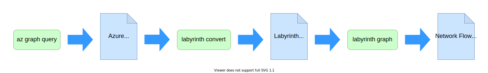
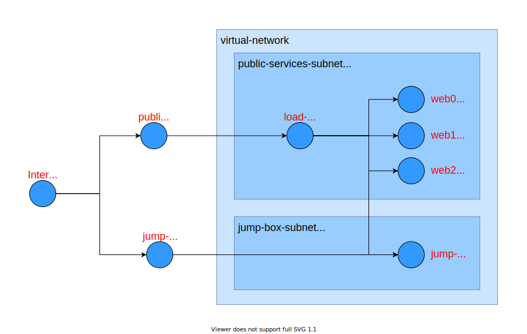
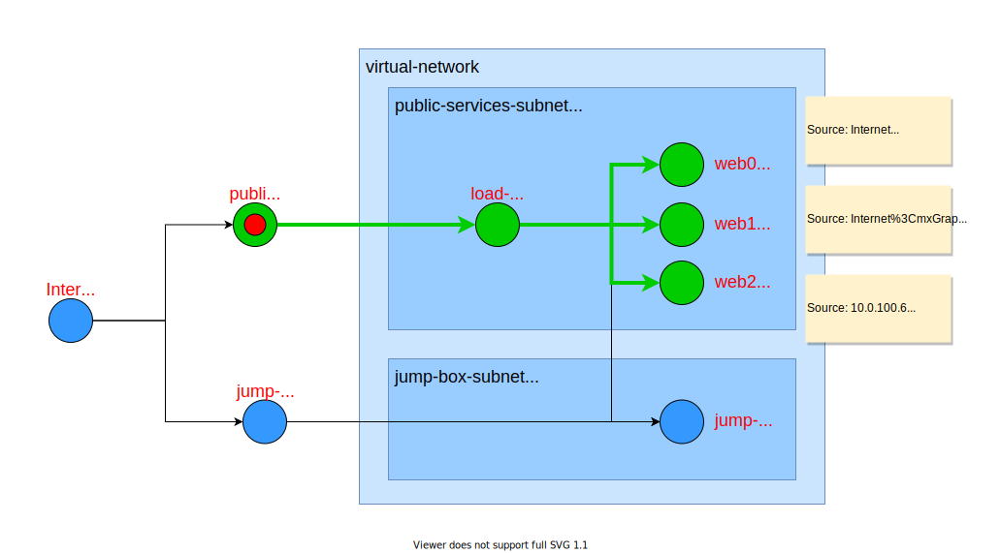
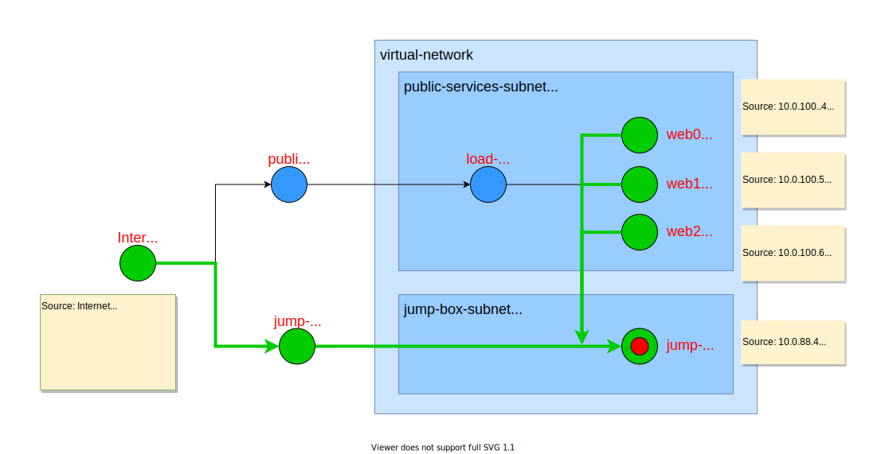

# Azure Resource Graphs

`Labyrinth` was originally designed to analyze [Azure](https://azure.microsoft.com/en-us/) networks, answering questions like
* Which servers can receive traffic directly from the internet?
* Can traffic from the internet reach my database?
* Which services can my front-end web servers interact with?
* Can my back-end web service call out to services on the internet?
* Is the jump-box the only server that can SSH to the front-end web servers?

Currently the Azure converter for `Labyrinth` models [OSI Layer 3](https://en.wikipedia.org/wiki/OSI_model#Layer_3:_Network_Layer) traffic. This means it can reason about IP packet headers fields, like the source and destination IP addresses and ports, and the protocol. The `Labyrinth` algorithm is fairly generic and capable of modeling concepts from other layers such as
* [Layer 4](https://en.wikipedia.org/wiki/OSI_model#Layer_4:_Transport_Layer) - e.g. TCP connection state and [stateful packet inspection](https://en.wikipedia.org/wiki/Stateful_firewall).
* [Layer 7](https://en.wikipedia.org/wiki/OSI_model#Layer_7:_Application_Layer) - e.g. [Application Gateways](https://docs.microsoft.com/en-us/azure/application-gateway/overview)

Today the Azure converter provides partial support for the following Azure Resource Graph constructs:
* Public IPs with NAT
* Private IPs
* Virtual networks
* Routing tables
* Subnets
* Load balancers with NAT and port mapping
* Scale sets
* Virtual machines
* Network interface cards
* Network security groups
* Azure backbone
* Internet backbone

## Graph Analysis Workflow
The analysis process starts with an
[Azure Resource Graph](https://docs.microsoft.com/en-us/azure/governance/resource-graph/overview#:~:text=Azure%20Resource%20Graph%20is%20a,can%20effectively%20govern%20your%20environment.), which you can obtain from your Azure tenant. `Labyrinth` will convert your resource graph to a generic graph representation and then then perform reachability analysis.

The steps are
1. Export an Azure Resource Graph from your tenant, or use one of the included samples.
2. Use `labyrinth convert` to transform the resource graph to a Labyrinth graph.
3. Use `labyrinth graph` to generate a reachability report.

## Sample Resource Graphs
Labyrinth includes 10 sample resource graphs, which can be found in the
[data/azure/examples](../data/azure/examples) folder. This tutorial uses the graph in [data/azure/examples/00.demo/resource-graph.json](../data/azure/examples/00.demo/resource-graph.json). This is a fairly simple network with three web servers behind a load balancer and a jump box, which is accessible via SSH for diagnostic purposes. Network security rules allow only HTTP and HTTPS traffic from the `public-services-ip` to the web servers. The jump-box is accessible via the `jump-box-ip`, using SSH, and it can access the web servers via SSH.

## Exporting and Converting the Azure Resource Graph

If you'd prefer to analyze your own resource graph, you can use the following [az](https://docs.microsoft.com/en-us/cli/azure/) command to export a copy. Just replace the `"00000000-0000-0000-0000-000000000000"` with your subscription id.

~~~
% az graph query --output json -q 'Resources | where subscriptionId == "00000000-0000-0000-0000-000000000000" | where type !in ("microsoft.compute/virtualmachines/extensions", "microsoft.compute/disks", "microsoft.compute/sshpublickeys", "microsoft.storage/storageaccounts")' > resource-graph.json
~~~

Once you have your resource graph, use the `convert.js` application to transform it into a [Labyrinth graph file](../data/azure/examples/00.demo/convert.yaml). The first parameter is the path to the resource graph. The second parameter is the path to write the Labyrinth graph file.

[//]: # (script labyrinth convert data/azure/examples/00.demo/resource-graph.json data/azure/examples/00.demo/convert.yaml)
~~~
$ labyrinth convert data/azure/examples/00.demo/resource-graph.json data/azure/examples/00.demo/convert.yaml
Azure resource graph input file: data/azure/examples/00.demo/resource-graph.json
Labyrinth graph output file: data/azure/examples/00.demo/convert.yaml
Conversion complete.
All Azure resource graph types understood.

~~~

You are now ready to perform reachability analysis.

## Tracing Flows _from_ a Node

Suppose we're interested in tracing all of the traffic that could flow _into_ the network from the `public-services-ip` node. We expect traffic to the green nodes in the following diagram:

We can use the `graph.js` application with the `-f=public-services-ip` to show all flows _from_ `public-services-ip`. The first parameter is the `Labyrinth graph` file, obtained from the Azure resource graph. 

[//]: # (script labyrinth graph data\azure\examples\00.demo\convert.yaml -f=public-services-ip)
~~~
$ labyrinth graph data\azure\examples\00.demo\convert.yaml -f=public-services-ip
Options summary:
  Not modeling source ip address spoofing (use -s flag to enable).
  Displaying endpoints only (use -r flag to display routing nodes). 
  Not displaying paths (use -s or -v flags to enable).
  Brief mode (use -v flag to enable verbose mode).
  Paths are forward propagated (use -b flag to enable backprojection).
  Paths are not expanded (use -e flag to enable path expansion).
  Not displaying help. (use -h flag to display help message)

Endpoints
  Internet
    Internet:  (endpoint)
    Internet-Backbone: 
  jump-box
    vm1/inbound:  (endpoint)
    vm1/outbound:  (endpoint)
  vm0
    vm2/inbound:  (endpoint)
    vm2/outbound:  (endpoint)
  vm1
    vm3/inbound:  (endpoint)
    vm3/outbound:  (endpoint)
  vm2
    vm4/inbound:  (endpoint)
    vm4/outbound:  (endpoint)

Nodes reachable from public-services-ip (publicIp2/endpoint):

vm0 (vm2/inbound):
  flow:
    source ip: Internet
    destination ip: 10.0.100.4
    destination port: 8080, 8443
    protocol: TCP

vm1 (vm3/inbound):
  flow:
    source ip: Internet
    destination ip: 10.0.100.5
    destination port: 8080, 8443
    protocol: TCP

vm2 (vm4/inbound):
  flow:
    source ip: Internet
    destination ip: 10.0.100.6
    destination port: 8080, 8443
    protocol: TCP

~~~

The tool first displays a summary of the command-line options in effect and a list of endpoints in the graph. After this it shows the flows to the three web servers. We can see, above, that each of the three web servers is reachable from the `Internet`, with destination ports `8080` and `8443` and the `TCP` protocol.

## Friendly Names

We just saw that the reachability report referred to nodes with strings like `"vm0 (vm2/inbound)"`. Usually, the first part of this string, in this case `"vm0"` is the node's "friendly name", which is typically the value in the `name` field of an object in the Azure resource graph.
The second part of the string, in this case `"(vm2/inbound)"`, displays the corresponding Labyrinth graph node key.

The friendly name and the Labyrinth node key differ because the translation from the Azure Resource Graph is not a one-to-one mapping. In many cases, a single Azure concept maps to a handful of nodes in the Labyrinth graph. An example is the NSG, which is mapped, during tranlation, into `inbound` and `outbound` nodes. Labyrinth generates sequentially numbered node keys for each node type without consulting the Azure node name field. Sometimes this leads to confusing output, when the Azure-based friendly names appear similar to unrelated Labyrinth node keys.

When specifying a node with the `-f` and `-t` flags, you may use either a friendly name or a Labyrinth node key. The system will first attempt to find the appropriate node, based on friendly name. If it doesn't find one, it will fall back to a search by node key.

If you are interested in seeing the mapping from friendly name to node key, look at the graph summary at the top of the reachability report. The nodes are presented as a two-level outline, where the first level shows the friendly names and the second level displays the corresponding Labyrinth node keys. The second level is not displayed in cases where the node key and the friendly name are identical.

We can use the `-r` flag to show the entire graph, including internal routing nodes:

[//]: # (script labyrinth graph data\azure\examples\00.demo\convert.yaml -r)
~~~
$ labyrinth graph data\azure\examples\00.demo\convert.yaml -r
Nodes:
  AzureBackbone
  Internet
    Internet:  (endpoint)
    Internet-Backbone: 
  jump-box
    vm1/inbound:  (endpoint)
    vm1/outbound:  (endpoint)
  jump-box-ip
  jump-box-subnet
  jump-box948
  public-load-balancer
  public-services-ip
  public-services-subnet
  virtual-network
  vm0
    vm2/inbound:  (endpoint)
    vm2/outbound:  (endpoint)
  vm0148
  vm1
    vm3/inbound:  (endpoint)
    vm3/outbound:  (endpoint)
  vm1318
  vm2
    vm4/inbound:  (endpoint)
    vm4/outbound:  (endpoint)
  vm2400

 
Use the -f or -t option to specify a node for analysis.
 
Use the -h flag for help.
 
Aborting
 

~~~

## Back-Projecting Network Address Translation and Port Mapping

In the [Tracing Flows _from_ a Node](#tracing-flows-from-a-node) section, we saw that the tool correctly identified `vm0`, `vm1`, and `vm2` as the only nodes that can receive traffic from `public-services-ip`, but the traffic header details were confusing because they described the IP packet headers, as seen on arrival at the web servers. For example, `vm0` will only see packets addressed to `10.0.0.4` for ports `8080` and `8443`:

~~~
vm0 (vm2/inbound):
  flow:
    source ip: Internet
    destination ip: 10.0.100.4
    destination port: 8080, 8443
    protocol: TCP
~~~

While these are, in fact, the only packets from `public-services-ip` that `vm0` will ever see, what we really want to know is contents of the packet headers, as viewed from `public-services-ip`. From outside of the `virtual-network` we can't even see `10.0.0.4` because it is an internal IP address. All we can see are the two public IPs, `52.183.88.216` and `52.156.96.94`.

In this example network, the `load-balancer` performs
[network address translation](https://en.wikipedia.org/wiki/Network_address_translation) from the public ip address `52.183.88.216` to one of the three web server ip addresses. It also performs port mapping, translating the `http` and `https` ports to `8080` and `8443`, respectively.

Labyrinth can provide a more useful analysis by `back-projecting` header flows to their starting values. In the following diagram, the headers have been labeled with their values on entry to the network at `public-services-ip`:

We enable back-projection with the `-b` flag. In the following example, we also use the `-q` flag to suppress the options summary and node list.

[//]: # (script labyrinth graph data\azure\examples\00.demo\convert.yaml -f=public-services-ip -b -q)
~~~
$ labyrinth graph data\azure\examples\00.demo\convert.yaml -f=public-services-ip -b -q
Nodes reachable from public-services-ip (publicIp2/endpoint):

vm0 (vm2/inbound):
  flow:
    source ip: Internet
    destination ip: 52.183.88.218
    destination port: http, https
    protocol: TCP

vm1 (vm3/inbound):
  flow:
    source ip: Internet
    destination ip: 52.183.88.218
    destination port: http, https
    protocol: TCP

vm2 (vm4/inbound):
  flow:
    source ip: Internet
    destination ip: 52.183.88.218
    destination port: http, https
    protocol: TCP

~~~

The output now shows the updated header flows to `vm0`, `vm1`, and `vm2`, _as seen from_ `public-services-ip`. 

## Finding Flows _to_ a Node

`Labyrinth` can also find all of the packets that can reach a specified node. Suppose we want to find all of the traffic _to_ the `jump-box`:

We can use the `-t` flag find flows _to_ a specified node. 
Note that we don't have to use the `-b` flag with the `-t` flag, because the reverse flow analysis from the `jump-box` endpoint will produce header flows as seen from the various starting points.

[//]: # (script labyrinth graph data\azure\examples\00.demo\convert.yaml -t=jump-box -q)
~~~
$ labyrinth graph data\azure\examples\00.demo\convert.yaml -t=jump-box -q
Nodes that can reach jump-box (vm1/inbound):

Internet:
  flow:
    source ip: AzureLoadBalancer
    destination ip: 52.156.96.94

    source ip: Internet
    destination ip: 52.156.96.94
    destination port: ssh
    protocol: TCP

jump-box (vm1/outbound):
  flow:
    source ip: 10.0.88.4
    destination ip: 10.0.88.4
    destination port: ssh

vm0 (vm2/outbound):
  flow:
    source ip: 10.0.100.4
    destination ip: 10.0.88.4

vm1 (vm3/outbound):
  flow:
    source ip: 10.0.100.5
    destination ip: 10.0.88.4

vm2 (vm4/outbound):
  flow:
    source ip: 10.0.100.6
    destination ip: 10.0.88.4

~~~

We can see from the output that traffic from the `Internet`, `vm0`, `vm1`, `vm2`, and the `jump-box` itself can reach the `jump-box`. 

## Virtual Traceroute
Sometimes we'd like to know the actual path the IP packets traverse on the way to their destination. We can use the `-p` flag to display paths. In the following example, we trace the route from `vm0` to the `jump-box`:

[//]: # (script labyrinth graph data\azure\examples\00.demo\convert.yaml -f=vm0 -t=jump-box -p -q)
~~~
$ labyrinth graph data\azure\examples\00.demo\convert.yaml -f=vm0 -t=jump-box -p -q
Routes from vm0 (vm2/outbound) to jump-box (vm1/inbound):

vm0 (vm2/outbound):
  flow:
    source ip: 10.0.100.4
    destination ip: 10.0.88.4

  paths:
    vm0 => vm0148 => public-services-subnet => virtual-network => jump-box-subnet => jump-box948 => jump-box
      source ip: 10.0.100.4
      destination ip: 10.0.88.4

~~~

The path is
* **vm0** - trace route starts at this server.
* **vm0148** - NIC applies outbound NSG rules.
  * In this example, the NIC does not have outbound rules.
* **public-services-subnet** - subnet applies outbound NSG rules.
  * These rules allow outbound traffic to the internet and to other addresses in `virtual-network`.
* **virtual-network** - routes traffic to `jump-box-subnet`.
* **jump-box-subnet** - subnet applies inbound NSG rules.
  * These rules restrict general access to port `22` and `TCP` protocol. A default Azure rule allows any traffic from `virtual-network`, regardless or port or protocol.
* **jump-box948** - NIC applies inbound NSG rules.
  * In this example, the NIC does not have inbound rules.
* **jump-box** - trace route ends here.

## Other Flags

The `graph.js` tool provides a number of other features, which can be enabled by command-line flags. You can use the `-h` flag to display a brief summary of the available flags:

[//]: # (script labyrinth graph -h)
~~~
$ labyrinth graph -h

Network graph reachability analyzer

  Utility for analyzing reachability in networks. 

Usage

  labyrinth graph <network.yaml> [...options] 

Required Parameters

  <network.yaml>   Path to a yaml file the defines the network topology and its 
                   routing and filtering rules.                                 

Options

  -f, --from <node>                Find all paths in the graph that start at    
                                   <node>.                                      
  -t, --to <node>                  Find all paths in the graph that can reach   
                                   <node>.                                      
  -u, --universe <universe.yaml>   Use provided Universe specification.         
                                   Default Universe is for firewall rules with  
                                   - source ip                                  
                                   - source port                                
                                   - destination ip                             
                                   - destination port                           
                                   - protocol                                   
                                                                                
  -v, --verbose                    Display routes for each path.                
  -p, --paths                      Displays paths for each route.               
  -q, --quiet                      Quiet mode - don't summarize options and     
                                   enumerate nodes.                             
  -r, --routers                    Display routers along paths.                 
  -s, --spoofing                   Model source address spoofing.               
  -b, --back-project               Backproject routes through NAT rewrites.     
                                   Note that back-projecting is enabled by      
                                   default when -t is used.                     
  -e, --expand                     Expand paths to show internal nodes.         

~~~
