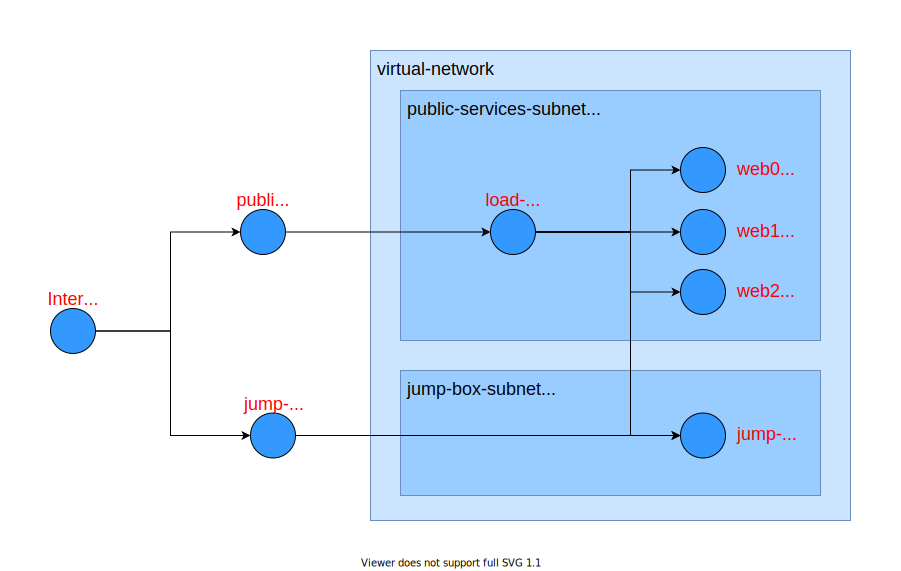

# Interactive Graph Exploration

The `labyrinth graph` command is great for finding out which traffic can flow where in a network. But what if you want to know why a certain traffic flow is allowed or disallowed? The `labyrinth explore` command lets you to interactively explore the graph, examining routing rules and observing their impact on traffic as you hop from node to node.

Let's do an example use the network graph in [data/azure/examples/00.demo/graph.yaml](../data/azure/examples/00.demo/graph.yaml).

For this example, let's suppose we were contacted by a network engineer who was attempting to perform diagnostics from an `ssh` session on the `jump-box`. The engineer wanted to install a utility on `jump-box`, but found the machine couldn't reach the internet to initiate the download.

We can confirm this, using `labyrinth graph` to look at outbound traffic _from_ the `jump-box`. We will see that it can only reach itself and web servers `web0`, `web1`, and `web2`. 

[//]: # (script labyrinth graph data/azure/examples/00.demo/graph.yaml -q -f=jump-box)
~~~
$ labyrinth graph data/azure/examples/00.demo/graph.yaml -q -f=jump-box
Nodes reachable from jump-box:

jump-box (vm1/inbound):
  flow:
    source ip: 10.0.88.4
    destination ip: 10.0.88.4
    destination port: ssh

web0 (vm2/inbound):
  flow:
    source ip: 10.0.88.4
    destination ip: 10.0.100.4
    destination port: ssh

web1 (vm3/inbound):
  flow:
    source ip: 10.0.88.4
    destination ip: 10.0.100.5
    destination port: ssh

web2 (vm4/inbound):
  flow:
    source ip: 10.0.88.4
    destination ip: 10.0.100.6
    destination port: ssh

~~~

There appears to be no route to the `Internet` node: 

[//]: # (script labyrinth graph data/azure/examples/00.demo/graph.yaml -q -f=jump-box -t=Internet)
~~~
$ labyrinth graph data/azure/examples/00.demo/graph.yaml -q -f=jump-box -t=Internet
Routes from jump-box to Internet:

jump-box (vm1/inbound):
  flow:
    (no flow)

jump-box (vm1/outbound):
  flow:
    (no flow)

~~~

We can even use the tool to run a virtual tracert from `vm1/outbound`, the outbound node of `jump-box`, to `web0`:

[//]: # (script labyrinth graph data/azure/examples/00.demo/graph.yaml -q -f=vm1/outbound -t=web0 -p -e)
~~~
$ labyrinth graph data/azure/examples/00.demo/graph.yaml -q -f=vm1/outbound -t=web0 -p -e
Routes from vm1/outbound to web0:

jump-box (vm1/outbound):
  flow:
    source ip: 10.0.88.4
    destination ip: 10.0.100.4
    destination port: ssh

  paths:
    vm1/outbound => nic1/outbound => subnet1/outbound => vnet1/outbound => vnet1/router => vnet1/inbound => subnet2/inbound => nic2/inbound => vm2/inbound
      source ip: 10.0.88.4
      destination ip: 10.0.100.4
      destination port: ssh

~~~

While the tracert will give us a better understanding of the routing structures in the network, it won't really shed light on why there are no routes to `Internet`

## Labyrinth Explorer
It's time to switch to `labyrinth explore`. This command starts up an interactive session where we can enter commands to follow packets through the network. You can use the `help` command to display a list of available commands:

[//]: # (interactive one > node.exe -i build/src/apps/labyrinth.js explore data/azure/examples/00.demo/graph.yaml)
~~~
Welcome to the Labyrinth interactive graph explorer.
Type commands below.

Type "exit" or "<CTRL>-D" to end the session.
Type "help" for information on commands.

Analyzing data/azure/examples/00.demo/graph.yaml.
	
> help

Commands

  back               Go back to previous node on the path.                      
  back!              Go back to previous node on the path and continue          
                     retreating until encountering a fork in the path.          
  edges              Display edges from current node.                           
  from <node>        Set initial node for a forward traversal.                  
  history [<n>]      Display last <n> steps of command history. <n> defaults to 
                     20.                                                        
  nodes              Display a list all of the nodes in the graph.              
  path               Display current traversal path and headers.                
  spec [<node>]      Print out the specification for a node. Defaults to        
                     current node.                                              
  symbols [<name>]   Display symbol table entry.                                
  to <node>          Set end node for backwards traversal.                      
  <number>           Advance to the specified next step on the path.            
  <number>!          Advance to the specified next step on the path and         
                     continue advancing until encountering a fork in the path.  

~~~

Since that `labyrinth explore` session examines the graph, it is helpful to know the node keys that correspond to higher level structures in the network. We can use the `nodes` command to display node keys, grouped by friendly name. Moving forward, we will use the node keys when referring to graph nodes:

[//]: # (interactive one > node.exe -i build/src/apps/labyrinth.js explore data/azure/examples/00.demo/graph.yaml)
~~~
> nodes
AzureBackbone
  AzureBackbone/outbound
Internet
  Internet
Internet-Backbone
  Internet-Backbone
jump-box
  vm1/inbound
  vm1/outbound
jump-box-ip
  publicIp1/inbound
  publicIp1/outbound
jump-box-subnet
  subnet1/inbound
  subnet1/outbound
jump-box948
  nic1/inbound
  nic1/outbound
public-load-balancer
  loadBalancer1
public-services-ip
  publicIp2/inbound
public-services-subnet
  subnet2/inbound
  subnet2/outbound
virtual-network
  vnet1/inbound
  vnet1/outbound
  vnet1/router
vm0148
  nic2/inbound
  nic2/outbound
vm1318
  nic3/inbound
  nic3/outbound
vm2400
  nic4/inbound
  nic4/outbound
web0
  vm2/inbound
  vm2/outbound
web1
  vm3/inbound
  vm3/outbound
web2
  vm4/inbound
  vm4/outbound

~~~

We can see, in the above list, that the `jump-box` corresponds to a pair of graph nodes. The `vm1/inbound` node handles traffic to the `jump-box`, while `vm1/outbound` handles outbound traffic.

The typical explorer workflow involves selecting a node in the graph where the exploration will start. Use the `from <node>` command to explore the graph, following outbound edges. If you want to walk backwards over inbound edges, use the `to <node>` command. In this examples, we'll start exploring outbound edges from `vm1/outbound`:

[//]: # (interactive one > node.exe -i build/src/apps/labyrinth.js explore data/azure/examples/00.demo/graph.yaml)
~~~
> from vm1/outbound
	
vm1/outbound
(universe)
	
Next step forward:
  0: nic1/outbound

~~~

After you select a starting node, with either the `from` or `to` command, `labyrinth` displays the current path, the set of headers that can flow to this point on the path, and a list of edges, each of which can serve as the next step on the path.

In this example, the path has only a single node, which is `vm1/outbound`. The current set of headers is `(universe)`, which means that any IP packet can be introduced into the network from `vm1/outbound`. There is only one option for a next step, and this is to `nic1/outbound`. If you ever get lost during your exploration, you can use the `path` command to display this information again.

We can step ahead by typing in the number of the edge we'd like to take. In this case, the only available edge is number `0`:

[//]: # (interactive one > node.exe -i build/src/apps/labyrinth.js explore data/azure/examples/00.demo/graph.yaml)
~~~
> 0
vm1/outbound => nic1/outbound
	
source ip: 10.0.88.4
	
Next step forward:
  0: subnet1/outbound

~~~

This extends the path to `nic1/outbound`, while constraining the flow to packets with `sourceIP` equal to `10.0.88.4`. The only edge forward is to `subnet1/outbound`. Let's step there and then step again to `vnet1/outbound`:

[//]: # (interactive one > node.exe -i build/src/apps/labyrinth.js explore data/azure/examples/00.demo/graph.yaml)
~~~
> 0
vm1/outbound => nic1/outbound => subnet1/outbound
	
source ip: 10.0.88.4
	
Next step forward:
  0: vnet1/outbound

> 0
vm1/outbound => nic1/outbound => subnet1/outbound => vnet1/outbound
	
source ip: 10.0.88.4
destination ip: vnet1
destination port: ssh
	
Next step forward:
  0: vnet1/router

~~~

Note that when we step out of `subnet1\outbound`, the packet flow is constrained further, to packets with `destinationIp` in the `vnet` and `destination port` targetting the `ssh` port. This constraint on the `destinationIp` is probably the reason that packets aren't getting to the `Internet`. Let's step forward to `vnet1/router` to see if this is the case:

[//]: # (interactive one > node.exe -i build/src/apps/labyrinth.js explore data/azure/examples/00.demo/graph.yaml)
~~~
> 0
vm1/outbound => nic1/outbound => subnet1/outbound => vnet1/outbound => vnet1/router
	
source ip: 10.0.88.4
destination ip: vnet1
destination port: ssh
	
Next step forward:
  0: vnet1/inbound

~~~

At this point, we see that the only available step forward is to `vnet/inbound`. This is curious because it seems like the router should be able to get to the `Internet`. We can use the `edges` command to look at the actual edges in the graph, leaving `vnet1/router`:

[//]: # (interactive one > node.exe -i build/src/apps/labyrinth.js explore data/azure/examples/00.demo/graph.yaml)
~~~
> edges
	
vnet1/router => loadBalancer1
  routes:
    destination ip: 52.183.88.218
	
vnet1/router => vnet1/inbound
  routes:
    destination ip: vnet1

~~~

We can see from the output that `vnet1/router` has two outbound edges. The reason we're only offered a next step to `vnet1/inbound` is that the `destinationIp` constraint of `52.183.88.218` on the edge to `loadBalancer1` eliminates all of the packets that were previously constrained to targetting `destinationIps` within `vnet1`.

Still, from the edges in the graph, it appears that the router cannot reach the internet under any circumstances. It can only route to `loadBalancer1` and `vnet1/inbound`. Perhaps there is another node on our path that can get to the `Internet`. Let's use the `back` command to step backwards to `vnet1/outbound` and then run the edges command again:

[//]: # (interactive one > node.exe -i build/src/apps/labyrinth.js explore data/azure/examples/00.demo/graph.yaml)
~~~
> back
vm1/outbound => nic1/outbound => subnet1/outbound => vnet1/outbound
	
source ip: 10.0.88.4
destination ip: vnet1
destination port: ssh
	
Next step forward:
  0: vnet1/router

> edges
	
vnet1/outbound => vnet1/router
  routes:
    destination ip: vnet1
	
vnet1/outbound => publicIp1/outbound
  routes:
    source ip: 10.0.88.4
    destination ip: Internet
	
vnet1/outbound => AzureBackbone/outbound
  routes:
    source ip: except 10.0.88.4
    destination ip: Internet

~~~

We can see that `vnet1/outbound` has only one available step, even though it has edges to `vnet1/router`, `publicIp1/outbound`, and `AzureBackbone/outbound`. We suspect this last edge can get to the `Internet` and we can verify our hypothesis by using the `edges` command with a node parameter to inspect `AzureBackbone/outbound` and `Internet-Backbone`:

[//]: # (interactive one > node.exe -i build/src/apps/labyrinth.js explore data/azure/examples/00.demo/graph.yaml)
~~~
> edges AzureBackbone/outbound
	
AzureBackbone/outbound => Internet-Backbone
  routes:
    (universe)

> edges Internet-Backbone
	
Internet-Backbone => publicIp1/inbound
  routes:
    source ip: Internet
    destination ip: 52.156.96.94
	
Internet-Backbone => publicIp2/inbound
  routes:
    source ip: Internet
    destination ip: 52.183.88.218
	
Internet-Backbone => Internet
  routes:
    destination ip: except vnet1, 52.156.96.94, 52.183.88.218

    source ip: vnet1
    destination ip: Internet

~~~

We can see that `AzureBackbone/outbound` has routes to `Internet-Backbone` which has routes to `Internet`. So the question is, why did the current node, `vnet1/outbound`, disallow traffic to `AzureBackbone/outbound`? The reason is that the first edge, the one to `vnet1/router`, diverted all traffic with `destinationIp` targetting addresses in `vnet1`.

We saw that the `destinationIp` constraint was introduced when we stepped out of `subnet1/outbound`. Let's step back and take a look:

[//]: # (interactive one > node.exe -i build/src/apps/labyrinth.js explore data/azure/examples/00.demo/graph.yaml)
~~~
> back
vm1/outbound => nic1/outbound => subnet1/outbound
	
source ip: 10.0.88.4
	
Next step forward:
  0: vnet1/outbound

> edges
	
subnet1/outbound => vnet1/outbound
  routes:
    source ip: vnet1
    destination ip: vnet1
    destination port: ssh

~~~

We can see that the sole edge from `subnet1/outbound` constrained the `destinationIp` to `vnet1`. To see why, let's use the `spec` command to display the node specification for `subnet1/outbound`:

[//]: # (interactive one > node.exe -i build/src/apps/labyrinth.js explore data/azure/examples/00.demo/graph.yaml)
~~~
> spec
	
internal: true
key: subnet1/outbound
friendlyName: jump-box-subnet
routes:
  - destination: vnet1/outbound
filters:
  - action: allow
    priority: 105
    id: 1
    source: data/azure/resource-graph-1.json
    constraints:
      sourceIp: vnet1
      sourcePort: '*'
      destinationIp: vnet1
      destinationPort: '22'
      protocol: '*'
  - action: deny
    priority: 110
    id: 1
    source: data/azure/resource-graph-1.json
    constraints:
      sourceIp: '*'
      sourcePort: '*'
      destinationIp: '*'
      destinationPort: '*'
      protocol: '*'
  - action: allow
    priority: 65000
    id: 1
    source: data/azure/resource-graph-1.json
    constraints:
      sourceIp: vnet1
      sourcePort: '*'
      destinationIp: vnet1
      destinationPort: '*'
      protocol: '*'
  - action: allow
    priority: 65001
    id: 1
    source: data/azure/resource-graph-1.json
    constraints:
      sourceIp: '*'
      sourcePort: '*'
      destinationIp: Internet
      destinationPort: '*'
      protocol: '*'
  - action: deny
    priority: 65500
    id: 1
    source: data/azure/resource-graph-1.json
    constraints:
      sourceIp: '*'
      sourcePort: '*'
      destinationIp: '*'
      destinationPort: '*'
      protocol: '*'

~~~

Here we see, under `routes`, that there is, in fact, a route to `vnet1/outbound`. The route doesn't have any constraints, but node also has a set of five `filters`. The first filter allows `ssh` traffic with `destinationIp` in `vnet1` and the second rule disallows all other traffic. It is the combination of these two rules the prevent traffic from reaching the `Internet`.
